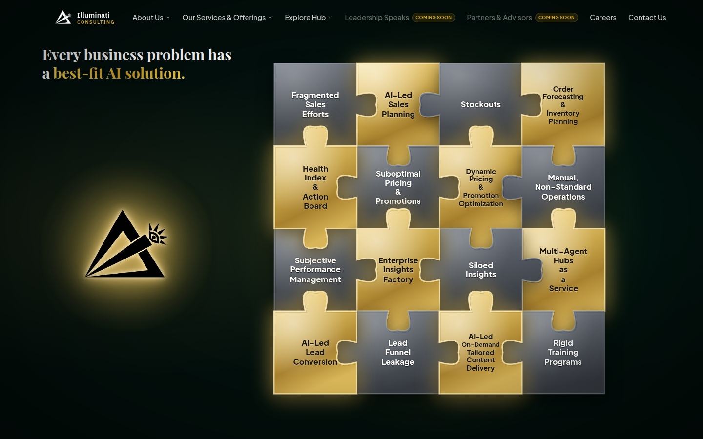
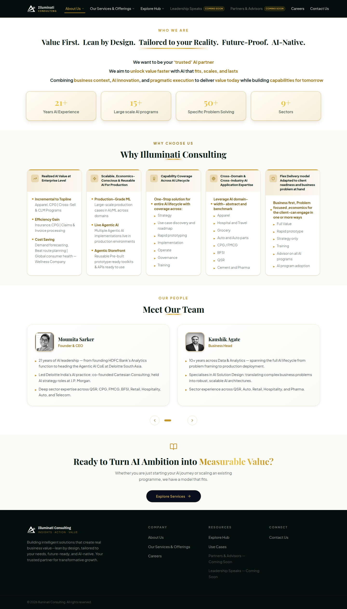
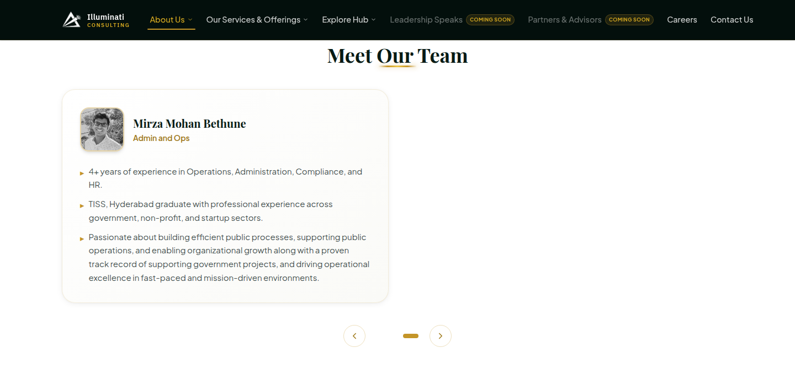
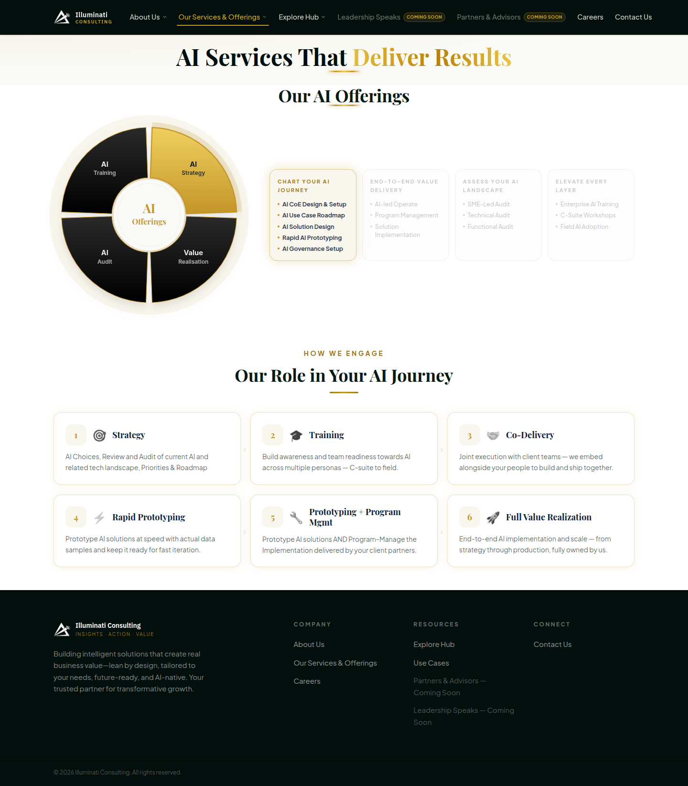
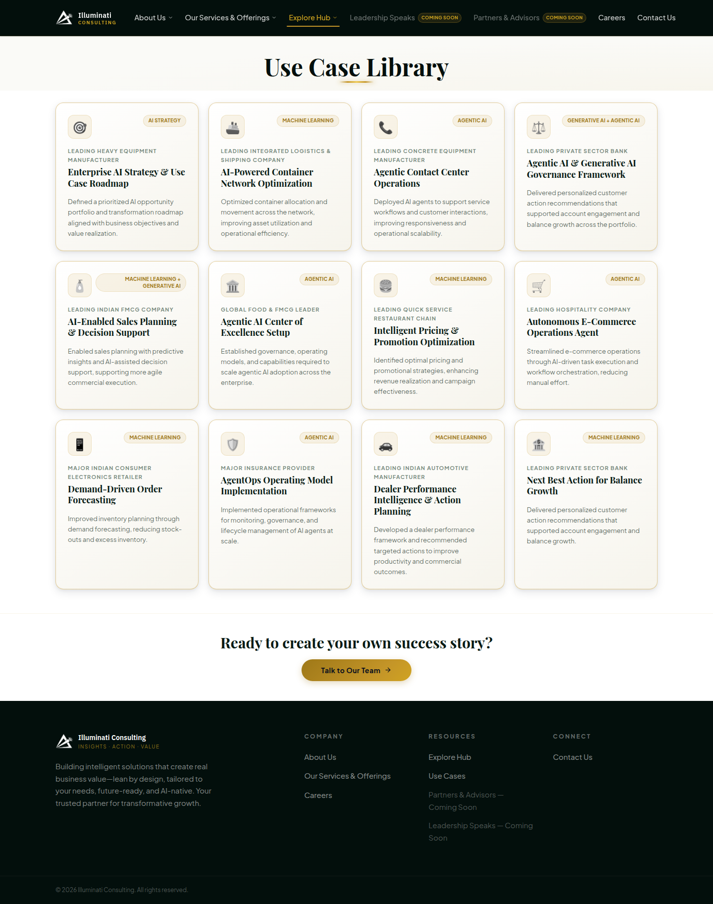
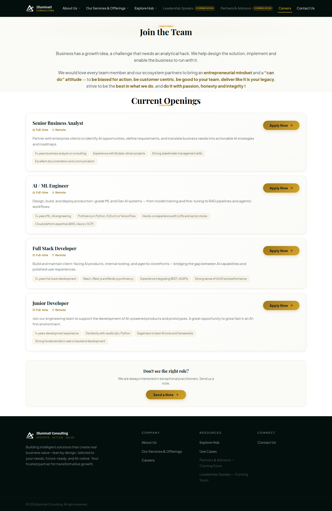
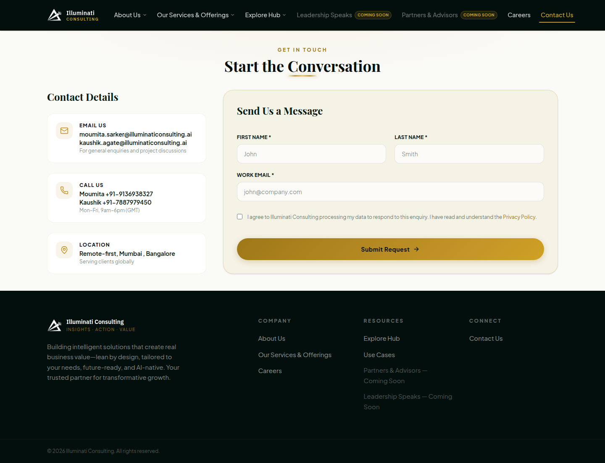

# Illuminati Consulting: current website content

Everything published on https://www.illuminaticonsulting.ai as of **25 Sep 2026**. This is the reference for the rebrand. Copy is **verbatim**, including the original typos, unless marked *[note]*.

- Crawled pages: `/`, `/home`, `/services`, `/explore`, `/careers`, `/contact`, `/legal`. The site has no other pages.
- Screenshots: [`screenshots/`](screenshots/)
- Logo and team photos downloaded from the site: [`assets/`](assets/)
- Observations and issues are collected at the end, in [Audit notes](#audit-notes), separate from the content.

---

## 1. Site-wide

### Identity
| Item | Value |
|---|---|
| Name | Illuminati Consulting |
| Tagline | Insights · Action · Value (also written "Insights. Action. Value.") |
| Logo | Triangle with an eye and radiating rays. Supplied in two versions: black (`assets/logo.png`) and white (`assets/logowhite.png`), both 1254×1254 PNG |
| Favicon | `/icon.png` (1080×1080) |
| Wordmark (in the header) | "Illuminati" in white, with "CONSULTING" beneath it in small gold capitals with wide letter spacing |

### Meta / SEO
- **Title (home):** Illuminati Consulting — Insights. Action. Value.
- **Meta description (home):** Illuminati Consulting is an AI-first advisory firm helping enterprises harness Generative AI, Agentic AI, and Machine Learning to unlock measurable business value.
- **Keywords:** AI consulting, Generative AI, Agentic AI, Machine Learning, AI strategy, Enterprise AI, AI governance, AI training, Illuminati Consulting
- **OG description:** AI-first advisory firm specialising in Gen AI, Agentic AI, ML strategy, and enterprise transformation.
- **Twitter description:** AI strategy, Gen AI, Agentic AI, and ML consulting for enterprises.
- **OG image:** `https://illuminaticonsulting.ai/og-image.png` *[note: returns 404]*

| Page | `<title>` | Meta description |
|---|---|---|
| `/services` | Our Services \| Illuminati Consulting | Comprehensive AI consulting services: Strategy, Gen AI, Agentic AI, Audit, Training, ML & Data. From advisory to full delivery. |
| `/explore` | Explore Hub \| Illuminati Consulting | — |
| `/careers` | Careers \| Illuminati Consulting | — |
| `/contact` | Contact & Demo \| Illuminati Consulting | Book a free AI strategy call with Illuminati Consulting. Request a demo, start a project, or discuss your AI challenges. |
| `/legal` | Privacy Policy & Terms of Service \| Illuminati Consulting | — |

### Navigation (header)
| Item | Link | Dropdown |
|---|---|---|
| About Us | `/home` | Who we are (`#who-we-are`) · Why us (`#why-us`) · Meet our team (`#meet-our-team`) |
| Our Services & Offerings | `/services` | Our AI offerings (`#offerings`) · Roles we play (`#engagement`) |
| Explore Hub | `/explore` | Use cases library (`#use-cases`) |
| Leadership Speaks | — | Not clickable; shown with a "COMING SOON" badge |
| Partners & Advisors | — | Not clickable; shown with a "COMING SOON" badge |
| Careers | `/careers` | — |
| Contact Us | `/contact` | — |

The mobile menu is a slide-in drawer with the same items and the text "INSIGHTS · ACTION · VALUE" at the bottom.

### Footer
- **Brand block:** Illuminati Consulting · INSIGHTS · ACTION · VALUE
- **Blurb:** "Building intelligent solutions that create real business value—lean by design, tailored to your needs, future-ready, and AI-native. Your trusted partner for transformative growth."
- **Company:** About Us · Our Services & Offerings · Careers
- **Resources:** Explore Hub · Use Cases · Partners & Advisors — Coming Soon · Leadership Speaks — Coming Soon
- **Connect:** Contact Us
- **Copyright:** © 2026 Illuminati Consulting. All rights reserved.

### Visual system (from the site CSS)
| Token | Value | Notes |
|---|---|---|
| `navy-900` | `#030f0c` | Named "navy", but actually a near-black **green**. Used for the header, footer and home page background |
| `navy-800` | `#071a14` | Body text colour |
| `navy-700` | `#0c201a` | |
| `navy-600` | `#132b22` | |
| `navy-500` | `#1b3d2c` | |
| `gold-300` | `#eec84a` | |
| `gold-400` | `#d4a820` | Accent on dark backgrounds |
| `gold-500` | `#c49528` | Primary gold |
| `gold-600` | `#9e7818` | Accent on light backgrounds |
| `gold-700` | `#7a5e10` | |
| `cream-50` | `#fafaf7` | Page background |
| `cream-100` | `#f5f5ef` | |

- **Fonts loaded:** Playfair Display (headings), Plus Jakarta Sans (default sans), Inter, IBM Plex Sans (wordmark and nav), IBM Plex Serif. That's five families.
- **Motifs:**
  - a gold "shimmer" gradient on key words
  - a short gold divider under headings
  - small tracked uppercase gold eyebrow labels
  - cards on cream backgrounds with thin gold borders
  - grayscale emoji used as icons
- **Tech:** Next.js, Google Analytics 4 (`G-RL3WKZ8EY2`), Microsoft Clarity.

---

## 2. Home — `/` (landing / intro)

**Headline:** Every business problem has a **best-fit AI solution.** (the second half is in gold)

**Desktop:** the logo glows on the left. On the right is a 4×4 puzzle of gold and grey pieces, where each business problem fits into its AI solution. A side panel automatically cycles through the eight pairs, and a **"Pause & Explore"** button stops the animation. Each panel has four fields: BUSINESS CHALLENGE · AI USE CASE · AI TOOLKIT · BUSINESS VALUE.

| # | Business challenge | AI use case | AI toolkit | Business value |
|---|---|---|---|---|
| 1 | Fragmented Sales Efforts | AI-Led Sales Planning | ML + GenAI | +4% Topline Growth |
| 2 | Stockouts | Order Forecasting & Inventory Planning | ML + Agentic | Better Customer Experience & Working Capital Unlock |
| 3 | Suboptimal Pricing & Promotions | Dynamic Pricing & Promotion Optimization | ML | +3% Margin Unlock |
| 4 | Manual, Non-Standard Operations | Multi-Agent Hubs as a Service | Agentic | 40% Efficiency Gain |
| 5 | Subjective Performance Management | Health Index & Action Board | ML + Agentic | 20% Productivity Gain |
| 6 | Siloed Insights | Enterprise Insights Factory | GenAI + Agentic | Better Decision Support |
| 7 | Lead Funnel Leakage | AI-Led Lead Conversion | ML + Agentic | 2% Increase in Lead Conversion |
| 8 | Rigid Training Programs | AI-Led On-Demand Tailored Content Delivery | Agentic | Higher Employee Productivity |

**Mobile** ([screenshot](screenshots/root_mobile.png)): the puzzle is not shown at all. Instead there is a splash screen: the glowing logo, "Illuminati Consulting", "INSIGHTS · ACTION · VALUE", and a gold **"Explore Here →"** button linking to `/home#who-we-are`.

---

## 3. About Us — `/home`

### 3.1 Who We Are (`#who-we-are`)
**Eyebrow:** WHO WE ARE
**Heading:** Value First. Lean by Design. Tailored to your Reality. Future-Proof. AI-Native.

Positioning lines (the bold phrases are shown in gold):
- We want to be your **'trusted' AI partner**
- We aim to **unlock value faster** with AI that **fits, scales, and lasts**
- Combining **business context**, **AI innovation**, and **pragmatic execution** to deliver **value today** while building **capabilities for tomorrow**

**Stats:**
| Number | Label |
|---|---|
| 21+ | Years AI Experience |
| 15+ | Large scale AI programs |
| 50+ | Specific Problem Solving |
| 9+ | Sectors |

### 3.2 Why Illuminati Consulting (`#why-us`)
**Eyebrow:** WHY CHOOSE US · **Heading:** Why Illuminati Consulting

1. **Realized AI Value at Enterprise Level**
   - **Incremental to Topline:** Apparel, CPG | Cross-Sell & CLM Programs
   - **Efficiency Gain:** Insurance,CPG | Claims & Invoice processing
   - **Cost Saving:** Demand forecasting, Beat route planning | Global consumer health — Wellness Company
2. **Scalable, Economics-Conscious & Reusable AI For Production**
   - **Production-Grade ML:** Large-scale production cases in AI/ML across domains
   - **Live Agentic AI:** Multiple Agentic AI implementations live in production environments
   - **Agentic Storefront:** Reusable Pre-built prototype ready toolkits & APIs ready to use
3. **Capability Coverage Across AI Lifecycle**
   - **One-Stop solution for entire AI lifecycle with coverage across:** Strategy · Use case discovery and roadmap · Rapid prototyping · Implementation · Operate · Governance · Training
4. **Cross-Domain & Cross-Industry AI Application Expertise**
   - **Leverage AI domain-width- abstract and benchmark:** Apparel · Hospital and Travel · Grocery · Auto and Auto parts · CPG / FMCG · BFSI · QSR · Cement and Pharma
5. **Flex Delivery model Adapted to client readiness and business problem at hand**
   - **Business first, Problem focused ,economics for the client-can engage in one or more ways:** Full Value · Rapid prototype · Strategy only · Training · Advisor on all AI programs · AI program adoption

### 3.3 Meet Our Team (`#meet-our-team`)
**Eyebrow:** OUR PEOPLE · **Heading:** Meet Our Team. A carousel shows 2 people per page across 4 pages; only the first page is visible without clicking.

**Moumita Sarker, Founder & CEO** (photo: `assets/moumita.png`)
- 21 years of AI leadership — from founding HDFC Bank's Analytics function to heading the Agentic AI CoE at Deloitte South Asia.
- Led Deloitte India's AI practice; co-founded Cartesian Consulting; held AI strategy roles at J.P. Morgan.
- Deep sector expertise across QSR, CPG, FMCG, BFSI, Retail, Hospitality, Auto, and Telecom.

**Kaushik Agate, Business Head** (photo: `assets/kaushik.png`)
- 10+ years across Data & Analytics — spanning the full AI lifecycle from problem framing to production deployment.
- Specialises in AI Solution Design: translating complex business problems into robust, scalable AI architectures.
- Sector experience across QSR, Auto, Retail, Hospitality, and Pharma.

**Sahil Boora, Senior Business Analyst**
- 9+ years across analytics, CRM, and consulting.
- Specialises in business problem framing and AI solution delivery: translating enterprise priorities into practical GenAI, Agentic AI, and ML solutions.
- Sector experience across QSR, Retail, CPG/FMCG, Hospitality, and Fintech, with deep expertise in customer growth, lifecycle management, and marketing analytics.

**Ayesha Modak, Business Analyst**
- Draws on a multidisciplinary background spanning marketing, customer engagement, and business analysis
- Brings a balanced perspective that combines creative thinking with structured problem-solving
- Applies a practical lens to how strategy is translated into measurable business outcomes

**Palak Makwana, Jr. AI Engineer**
- 2+ years of experience in AI Engineering — building scalable AI and Full-Stack solutions from development to deployment.
- Specializes in Generative AI, LLMs, and Full-Stack Development, creating intelligent, production-ready applications.
- Hands-on experience across the AI lifecycle — from model development and API integration to cloud deployment.
- Passionate about solving real-world business challenges with scalable, efficient, and innovative AI solutions.

**Viren Bhalgamiya, Jr. AI Engineer**
- 1+ year of professional experience in building scalable APIs, services, and production-grade applications.
- Hands-on experience developing and integrating AI and LLM-powered solutions for real-world business and engineering requirements.
- Experience designing scalable backend architectures and distributed systems with a focus on reliability, performance, and maintainability.
- Proven ability to translate complex requirements into efficient, robust, and production-ready technical solutions.

**Mirza Mohan Bethune, Admin and Ops**
- 4+ years of experience in Operations, Administration, Compliance, and HR.
- TISS, Hyderabad graduate with professional experience across government, non-profit, and startup sectors.
- Passionate about building efficient public processes, supporting public operations, and enabling organizational growth along with a proven track record of supporting government projects, and driving operational excellence in fast-paced and mission-driven environments.

### 3.4 Closing CTA
**Ready to Turn AI Ambition into Measurable Value?**
Whether you are just starting your AI journey or scaling an existing programme, we have a model that fits.
Button: **Explore Services →** (`/services`)

---

## 4. Our Services & Offerings — `/services`

**Page heading:** AI Services That **Deliver Results**

### 4.1 Our AI Offerings (`#offerings`)
An interactive four-segment wheel with "AI Offerings" at the centre. Selecting a segment highlights its card.

| Segment | Card label | Items |
|---|---|---|
| **AI Strategy** | CHART YOUR AI JOURNEY | AI CoE Design & Setup · AI Use Case Roadmap · AI Solution Design · Rapid AI Prototyping · AI Governance Setup |
| **Value Realisation** | END-TO-END VALUE DELIVERY | AI-led Operate · Program Management · Solution Implementation |
| **AI Audit** | ASSESS YOUR AI LANDSCAPE | SME-Led Audit · Technical Audit · Functional Audit |
| **AI Training** | ELEVATE EVERY LAYER | Enterprise AI Training · C-Suite Workshops · Field AI Adoption |

### 4.2 Our Role in Your AI Journey (`#engagement`)
**Eyebrow:** HOW WE ENGAGE

| # | Model | Description |
|---|---|---|
| 1 | 🎯 Strategy | AI Choices, Review and Audit of current AI and related tech landscape, Priorities & Roadmap |
| 2 | 🎓 Training | Build awareness and team readiness towards AI across multiple personas — C-suite to field. |
| 3 | 🤝 Co-Delivery | Joint execution with client teams — we embed alongside your people to build and ship together. |
| 4 | ⚡ Rapid Prototyping | Prototype AI solutions at speed with actual data samples and keep it ready for fast iteration. |
| 5 | 🔧 Prototyping + Program Mgmt | Prototype AI solutions AND Program-Manage the Implementation delivered by your client partners. |
| 6 | 🚀 Full Value Realization | End-to-end AI implementation and scale — from strategy through production, fully owned by us. |

---

## 5. Explore Hub — `/explore`

**Heading:** Use Case Library. Twelve cards, each with a category tag, an anonymised client, a title and a one-line outcome.

| # | Category | Client (anonymised) | Title | Description |
|---|---|---|---|---|
| 1 | AI Strategy | Leading Heavy Equipment Manufacturer | Enterprise AI Strategy & Use Case Roadmap | Defined a prioritized AI opportunity portfolio and transformation roadmap aligned with business objectives and value realization. |
| 2 | Machine Learning | Leading Integrated Logistics & Shipping Company | AI-Powered Container Network Optimization | Optimized container allocation and movement across the network, improving asset utilization and operational efficiency. |
| 3 | Agentic AI | Leading Concrete Equipment Manufacturer | Agentic Contact Center Operations | Deployed AI agents to support service workflows and customer interactions, improving responsiveness and operational scalability. |
| 4 | Generative AI + Agentic AI | Leading Private Sector Bank | Agentic AI & Generative AI Governance Framework | Delivered personalized customer action recommendations that supported account engagement and balance growth across the portfolio. *[note: description copied from #12; does not match the title]* |
| 5 | Machine Learning + Generative AI | Leading Indian FMCG Company | AI-Enabled Sales Planning & Decision Support | Enabled sales planning with predictive insights and AI-assisted decision support, supporting more agile commercial execution. |
| 6 | Agentic AI | Global Food & FMCG Leader | Agentic AI Center of Excellence Setup | Established governance, operating models, and capabilities required to scale agentic AI adoption across the enterprise. |
| 7 | Machine Learning | Leading Quick Service Restaurant Chain | Intelligent Pricing & Promotion Optimization | Identified optimal pricing and promotional strategies, enhancing revenue realization and campaign effectiveness. |
| 8 | Agentic AI | Leading Hospitality Company | Autonomous E-Commerce Operations Agent | Streamlined e-commerce operations through AI-driven task execution and workflow orchestration, reducing manual effort. |
| 9 | Machine Learning | Major Indian Consumer Electronics Retailer | Demand-Driven Order Forecasting | Improved inventory planning through demand forecasting, reducing stock-outs and excess inventory. |
| 10 | Agentic AI | Major Insurance Provider | AgentOps Operating Model Implementation | Implemented operational frameworks for monitoring, governance, and lifecycle management of AI agents at scale. |
| 11 | Machine Learning | Leading Indian Automotive Manufacturer | Dealer Performance Intelligence & Action Planning | Developed a dealer performance framework and recommended targeted actions to improve productivity and commercial outcomes. |
| 12 | Machine Learning | Leading Private Sector Bank | Next Best Action for Balance Growth | Delivered personalized customer action recommendations that supported account engagement and balance growth. |

**Closing CTA:** Ready to create your own success story? Button: **Talk to Our Team →**

---

## 6. Careers — `/careers`

**Heading:** Join the Team

> Business has a growth idea, a challenge that needs an analytical hack. We help design the solution, implement and enable the business to run with it.
>
> We would love every team member and our ecosystem partners to bring an entrepreneurial mindset and a "can do" attitude — to be biased for action, be customer centric, be good to your team, deliver like it is your legacy, strive to be the best in what we do, and do it with passion, honesty and integrity !

### Current Openings (all Full-time · Remote)
**Senior Business Analyst**
Partner with enterprise clients to identify AI opportunities, define requirements, and translate business needs into actionable AI strategies and roadmaps.
- 5+ years business analysis or consulting
- Experience with AI/data-driven projects
- Strong stakeholder management skills
- Excellent documentation and communication

**AI / ML Engineer**
Design, build, and deploy production-grade ML and Gen AI systems — from model training and fine-tuning to RAG pipelines and agentic workflows.
- 3+ years ML / AI engineering
- Proficiency in Python, PyTorch or TensorFlow
- Hands-on experience with LLMs and vector stores
- Cloud platform expertise (AWS / Azure / GCP)

**Full Stack Developer**
Build and maintain client-facing AI products, internal tooling, and agentic storefronts — bridging the gap between AI capabilities and polished user experiences.
- 3+ years full stack development
- React / Next.js and Node.js proficiency
- Experience integrating REST / AI APIs
- Strong sense of UI/UX and performance

**Junior Developer**
Join our engineering team to support the development of AI-powered products and prototypes. A great opportunity to grow fast in an AI-first environment.
- 1+ years development experience
- Familiarity with JavaScript / Python
- Eagerness to learn AI tools and frameworks
- Strong fundamentals in web or backend development

**"Apply Now"** opens a modal titled "APPLY FOR <role>" with these fields: Full Name\*, Email\*, Phone\*, LinkedIn / Portfolio, Resume Link ("Paste a shareable link to your CV (set access to "anyone with the link")."), Why you're a great fit. Button: Submit Application. ([screenshot](screenshots/careers_apply.png))

**Don't see the right role?** We are always interested in exceptional practitioners. Send us a note. Button: **Send a Note**

---

## 7. Contact — `/contact`

**Eyebrow:** GET IN TOUCH · **Heading:** Start the Conversation

### Contact Details
| Type | Value | Sub-text |
|---|---|---|
| Email Us | moumita.sarker@illuminaticonsulting.ai · kaushik.agate@illuminaticonsulting.ai | For general enquiries and project discussions |
| Call Us | Moumita +91-9136938327 · Kaushik +91-7887979450 | Mon–Fri, 9am–6pm (GMT) |
| Location | Remote-first, Mumbai , Bangalore | Serving clients globally |

### Send Us a Message (form)
Fields: First Name\* · Last Name\* · Work Email\* · a consent checkbox ("I agree to Illuminati Consulting processing my data to respond to this enquiry. I have read and understand the Privacy Policy.") · Button: **Submit Request →**

---

## 8. Legal — `/legal`

**Privacy Policy & Terms of Service**, both "Last updated: May 2025".

**Privacy Policy** (summary of sections 1–7)
- **Data collected:** name, email, phone, company, job title and project details from the contact form or newsletter signup, plus analytics.
- **Use:** replying to enquiries, delivering services, newsletters, improving the site, and legal compliance. "We do not sell your data."
- **Retention:** up to 3 years.
- **Your rights:** access, correction and deletion, via privacy@illuminaticonsulting.ai, with a response within 30 days.
- **Cookies:** essential plus optional analytics.

**Terms of Service** (summary of sections 1–8)
- Acceptance of terms
- **IP:** site content belongs to Illuminati Consulting
- Consulting work is governed by separate SOWs or MSAs
- No warranties on content
- Limitation of liability
- Governing law: "applicable law" (no jurisdiction named)
- Terms may change
- Contact: legal@illuminaticonsulting.ai

---

## 9. Other public info (outside the website)
- **LinkedIn:** https://www.linkedin.com/company/illuminati-consulting · Founder: https://www.linkedin.com/in/moumitasarkervp/
- **LinkedIn company tagline:** "AI-first advisory firm helping enterprises harness Generative AI, Agentic AI, and Machine Learning to unlock measurable business value."
- **LinkedIn hiring post:** AI Engineers with 2–5 years of experience, in Mumbai, Bengaluru and Pune.
- **Founder profile:** Moumita was a speaker at Cypher 2025 (Analytics India Magazine). Her bio there describes capability-building programmes built on three toolkits: discussion-led learning, practical AI training on redacted use cases, and hands-on training.

---

## Audit notes

These are observations to inform the rebrand. They are not site content.

**Structure and user experience**
1. The landing page `/` is a single interactive graphic. It has no descriptive copy and no clear call to action on desktop, and **mobile visitors see only a splash screen**, so none of the problem → solution → value content reaches them.
2. At 1440px wide, the side panel on `/` is cut off at the right edge of the screen.
3. Two nav items are "Coming Soon" placeholders that go nowhere.
4. Five of the seven team members are hidden behind carousel clicks.
5. The same idea appears in three places: "Flex Delivery model" (About), the offerings wheel and "Roles we play" (Services).

**Content accuracy and consistency**
6. The industry lists don't agree:
   - the stat says "9+ Sectors"
   - the Why-Us card lists 8 groups
   - the bios name Telecom, Fintech and Pharma, which the card doesn't
   - LinkedIn uses a different list again
7. Use-case card #4 (bank governance framework) has the wrong description.
8. Careers lists four remote roles, but LinkedIn advertises AI Engineer roles (2–5 years) in Mumbai, Bengaluru and Pune.
9. The call hours say "(GMT)", but the phone numbers are Indian. IST is probably intended.
10. The privacy policy mentions a newsletter, but the site has no newsletter signup.
11. Copy has typos and odd phrasing: "domain-width- abstract", "Insurance,CPG", "focused ,economics", "Mumbai , Bangalore", "integrity !", and "Specific Problem Solving" as a stat label.

**Conversion**
12. The contact form has **no message or company field**, even though the page title promises "Contact & Demo" and "Book a free AI strategy call". There's no booking link.
13. The strongest proof is hidden: +4% topline, +3% margin, 40% efficiency, 20% productivity (only on the desktop puzzle) and the 12 case studies (on a secondary page).
14. The founder's pedigree (HDFC Bank, Deloitte, J.P. Morgan, Cartesian) only appears inside the team carousel.

**Brand and technical**
15. There are two visual worlds: dark green-black and gold on `/`, cream and gold everywhere else.
16. Five font families are loaded (Playfair, Plus Jakarta, Inter, IBM Plex Sans, IBM Plex Serif).
17. The "navy" colour tokens are actually dark green.
18. Emoji are used as icons.
19. `og-image.png` returns 404, so links shared on LinkedIn, WhatsApp and similar apps show no preview image.
20. The logo (a triangle with an eye) plays directly on "Illuminati" conspiracy imagery. That's worth a deliberate decision in the rebrand.
